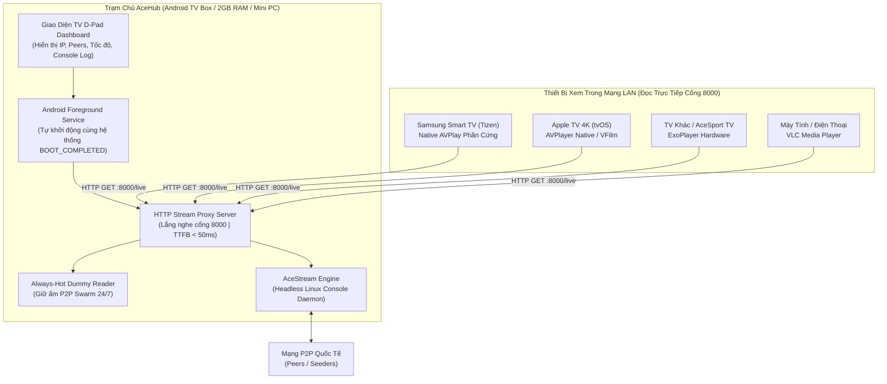

# AceHub (`AceHub-v1.4.4.apk`)

> **Trạm phát luồng AceStream nội bộ (Headless LAN Stream Gateway) siêu nhẹ cho Android TV Box & Mạng gia đình**

[](https://github.com/hongson117/aceHub/releases/tag/v1.4.4)
[](https://developer.android.com)
[]()
[]()
[](docs/AI_GUIDE.md)
[](LICENSE)

<p align="center">
  
</p>

---

## 👶 Tôi chưa biết gì – Bắt đầu từ đây

Nếu bạn hoàn toàn chưa từng nghe tới AceStream, địa chỉ IP hay mạng P2P, **đừng lo lắng**! Bạn không cần phải hiểu những khái niệm kỹ thuật đó để sử dụng AceHub.

### AceHub là gì?
Hãy tưởng tượng **AceHub** giống như một **"trạm tiếp sóng"** đặt trên chiếc Android TV Box trong nhà bạn:
1. Bạn đưa cho AceHub một **mã luồng** (gọi là Content ID hoặc Infohash).
2. AceHub sẽ tự động nhận dữ liệu của luồng đó qua mạng và biến nó thành một đường link video cực kỳ đơn giản:
   ```text
   http://192.168.1.100:8000/live
   ```
   *(Trong đó `192.168.1.100` là địa chỉ IP của chiếc Box nhà bạn).*
3. Bất kỳ thiết bị nào khác trong nhà (Smart TV phòng khách, Apple TV, máy tính xách tay, điện thoại...) chỉ cần mở đúng đường link trên là có thể xem video mượt mà.

### 4 Cam kết minh bạch của AceHub:
* ❌ **AceHub KHÔNG cung cấp danh sách kênh truyền hình.**
* ❌ **AceHub KHÔNG bán nội dung hay tài khoản xem phim.**
* ⚖️ **Người dùng tự chuẩn bị mã luồng (Content ID)** mà mình có quyền sử dụng hợp pháp.
* 💡 **Bạn không cần hiểu cấu trúc bên trong của AceStream** vẫn có thể cài đặt và sử dụng AceHub dễ dàng.

---

## 🚀 Xem được luồng trong 7 bước

Quy trình nhanh nhất để phát và xem luồng từ đầu đến cuối:

* **Bước 1:** Tải file **`AceHub-v1.4.4.apk`** từ [Releases](https://github.com/hongson117/aceHub/releases/tag/v1.4.4) và cài đặt lên Android TV Box của bạn.
* **Bước 2:** Mở ứng dụng **AceHub** trên màn hình TV Box.
* **Bước 3:** Chờ khoảng 10–20 giây cho đến khi màn hình hiển thị:
  * Huy hiệu trạng thái: **`🟢 ĐANG HOẠT ĐỘNG`**
  * Dòng trạng thái Engine: **`Engine: Sẵn sàng (Port 6878/62062)`**
* **Bước 4:** Để ô nhập liệu trống hoàn toàn và bấm nút **`⚡ Thử luồng mặc định / Infohash`**. AceHub sẽ tự động thử nghiệm một đoạn video mẫu có bản quyền mở để đảm bảo hệ thống thông suốt.
* **Bước 5:** Khi thấy thông báo test thành công, dùng remote bấm vào ô nhập liệu và điền **Content ID** của kênh bạn muốn xem.
* **Bước 6:** Bấm lại nút **`⚡ Thử luồng mặc định / Infohash`** một lần nữa. Chờ vài giây để AceHub kết nối nguồn phát (hiển thị có peers và tốc độ tải).
* **Bước 7:** Trên thiết bị bạn muốn xem (máy tính, điện thoại hoặc TV khác), mở đường link phát:
  ```text
  http://IP-CỦA-BOX:8000/live
  ```
  *(Ví dụ: `http://192.168.1.100:8000/live`)*

---

## 🧠 Chỉ cần hiểu 5 thứ này

Bạn không cần đọc sách giáo khoa về mạng máy tính, chỉ cần nhớ 5 khái niệm đơn giản sau:

| Khái niệm | Giải thích siêu ngắn gọn | Ví dụ thực tế |
| :--- | :--- | :--- |
| **Android TV Box** | Chiếc hộp nhỏ cắm vào TV dùng hệ điều hành Android (như FPT Play Box, Mi Box, Tanix...), nơi bạn cài đặt và chạy ứng dụng AceHub. | Chiếc Box đặt cạnh TV phòng khách. |
| **Content ID / Infohash** | Mã định danh duy nhất của một luồng phát video (thường là một chuỗi 40 ký tự gồm chữ và số). Có thể xem như "số hiệu kênh". | `dd8255ecdc7ca55fb0bbf81323...` |
| **Peer** | Những người/máy khác trên mạng đang cùng chia sẻ dữ liệu của luồng phát đó. Càng nhiều peer thì video tải về càng nhanh và ổn định. | Màn hình báo: `Peers: 15`. |
| **IP (Địa chỉ mạng)** | Tọa độ nhận diện của chiếc Android TV Box trong mạng WiFi/mạng dây gia đình bạn. | `192.168.1.100` |
| **/live** | Đuôi của đường link phát video trực tiếp. Mọi phần mềm xem phim đều dùng đuôi này để nhận hình ảnh. | `http://192.168.1.100:8000/live` |

---

## 🚦 AceHub đang nói gì với bạn?

Bảng đối chiếu chính xác các trạng thái hiển thị trên giao diện màn hình TV Box và việc bạn cần làm:

| Trạng thái trên màn hình | Ý nghĩa thực tế | Bạn cần làm gì? |
| :--- | :--- | :--- |
| **`⏳ ĐANG TẢI ENGINE`** | AceHub đang tự động tải gói Engine xử lý sạch (~40MB) về máy. | **Không bấm nút nào cả**, giữ mạng ổn định và chờ khoảng 15–30 giây. |
| **`📦 ĐANG GIẢI NÉN`** | Đang giải nén bộ Engine vào bộ nhớ của Box. | Tiếp tục chờ vài giây. |
| **`⚙️ ĐANG KHỞI CHẠY`** | Engine đang bật các cổng dịch vụ ngầm. | Chờ đến khi Engine sẵn sàng. |
| **`🟢 ĐANG HOẠT ĐỘNG`** | Trạm phát AceHub đã chạy hoàn hảo trên cổng 8000. | Sẵn sàng thử nghiệm hoặc phát kênh. |
| **`Engine: Sẵn sàng`** | Bộ máy P2P đã sẵn sàng tiếp nhận luồng. | Có thể bấm nút Thử tín hiệu. |
| **`Chưa có kênh nào được kích hoạt`** | App mới bật, chưa có luồng phát nào được chọn. | Bấm nút Thử luồng mặc định hoặc nhập Content ID. |
| **`0 peers` hoặc `Tốc độ: 0 KB/s`** | Chưa tìm thấy ai chia sẻ luồng phát này trên mạng. | Kiểm tra lại mã Content ID (xem có gõ sai không) hoặc thử nguồn phát khác. |
| **`Có peers` (Ví dụ: `Peers: 12`)** | Đã kết nối thành công vào mạng chia sẻ. | Chờ vài giây để dữ liệu video bắt đầu truyền về. |
| **`Đã nhận media` (`Tốc độ > 0 KB/s`)** | Video đang được nạp vào AceHub liên tục. | Mở đường link `/live` trên thiết bị xem để thưởng thức! |
| **`🔴 LỖI ENGINE`** | Bộ máy nền gặp sự cố hoặc bị hệ điều hành tắt. | Bấm nút **`🔄 Khởi động lại ngay (Force Restart)`**. |

---

## 🩺 Không xem được? Làm đúng theo cây này

Khi không xem được video trên TV hoặc máy tính, hãy kiểm tra lần lượt theo đúng sơ đồ chẩn đoán chuẩn sau:

```text
Không xem được
│
├── 1. Màn hình AceHub có hiện "🟢 ĐANG HOẠT ĐỘNG" và Engine "Sẵn sàng" không?
│   ├── [KHÔNG] ──> Bấm nút "🔄 Khởi động lại ngay" trên màn hình TV Box. Nếu vẫn lỗi, kiểm tra kết nối mạng của Box.
│   └── [CÓ]
│
├── 2. Bấm thử luồng mẫu (để trống ô nhập) có báo "Đã nhận media" không?
│   ├── [KHÔNG] ──> Kết nối Internet của TV Box đang bị chặn hoặc nghẽn mạng quốc tế.
│   └── [CÓ] (Hệ thống AceHub và Box chắc chắn 100% hoạt động tốt)
│
├── 3. Mã Content ID bạn vừa nhập có hiện "Peers > 0" không?
│   ├── [KHÔNG] ──> Mã bị gõ sai ký tự, nguồn phát đã offline hoặc không còn ai chia sẻ. Hãy đổi nguồn khác.
│   └── [CÓ]
│
├── 4. AceHub có báo nhận dữ liệu không? (Tốc độ > 0 KB/s)
│   ├── [KHÔNG] ──> Đợi thêm 15–30 giây để bắt đầu tải, hoặc nguồn quá yếu.
│   └── [CÓ]
│
└── 5. Mở link /live bằng phần mềm VLC trên máy tính hoặc điện thoại có xem được không?
    ├── [KHÔNG] ──> Kiểm tra xem máy tính/điện thoại có cùng bắt chung mạng WiFi với TV Box không.
    └── [CÓ]    ──> 🎉 AceHub hoạt động hoàn hảo! Vấn đề 100% nằm ở ứng dụng hoặc cài đặt trên TV đích.
```

---

## 🧪 Cách chắc chắn nhất để biết AceHub đã hoạt động

> [!TIP]
> **Quy tắc vàng:** Trước khi cấu hình trên Samsung TV (Tizen), Apple TV hay các ứng dụng phức tạp, **hãy luôn dùng phần mềm VLC Media Player để kiểm tra trước.**

1. Cài đặt **VLC Media Player** miễn phí trên máy tính xách tay (Windows/macOS) hoặc điện thoại di động (Android/iOS).
2. Đảm bảo thiết bị của bạn đang kết nối chung mạng WiFi với chiếc Android TV Box.
3. Mở VLC → Vào mục **Media** (hoặc Mạng) → Chọn **Open Network Stream** (Mở luồng mạng).
4. Dán địa chỉ phát hiển thị trên màn hình AceHub vào (Ví dụ: `http://192.168.1.100:8000/live`) và bấm **Play**.

* **Nếu VLC phát video bình thường:** Khẳng định 100% AceHub, bộ máy Engine và nguồn phát đều đang hoạt động hoàn hảo.
* **Nếu sau đó Smart TV hay app riêng không xem được:** Hãy tập trung kiểm tra ứng dụng hoặc cài đặt mạng trên TV đó, tuyệt đối không cần chỉnh sửa hay cài lại AceHub.

---

## 📺 Tôi muốn xem trên thiết bị nào?

AceHub phát luồng video chuẩn nguyên bản MPEG-TS (`video/mp2t`), tương thích với hầu hết mọi trình phát mạng trong gia đình:

* **Máy tính Windows:** Dùng **VLC Media Player** (Phím tắt `Ctrl + N` → Nhập `http://IP_BOX:8000/live` → Enter).
* **Máy tính macOS:** Dùng **VLC Media Player** hoặc trình phát **IINA** (Menu `File` → `Open URL...` → Dán link).
* **Điện thoại Android & Android TV phòng khác:** Dùng **VLC for Android**, **AceSport TV**, hoặc bất kỳ ứng dụng IPTV nào hỗ trợ đường dẫn HTTP trực tiếp.
* **iPhone / iPad:** Dùng ứng dụng **VLC for Mobile** (Mục `Network` → `Open Network Stream` → Dán link).
* **Apple TV (tvOS):** Dùng **VLC for Apple TV**, **VFilm**, hoặc các trình phát hỗ trợ Direct Network Stream.
* **Samsung Smart TV (Tizen):** Nếu sử dụng ứng dụng web chuyên dụng (Native AVPlay), nạp trực tiếp link `http://IP_BOX:8000/live` vào nguồn phát video phần cứng.

---

## 🤖 Bạn có thể nhờ AI hướng dẫn

Nếu bạn gặp khó khăn ở bất kỳ bước nào, bạn chỉ cần sao chép toàn bộ đường link GitHub này:
```text
https://github.com/hongson117/aceHub
```
Gửi cho **ChatGPT**, **Google Gemini** hoặc **Claude** kèm câu lệnh sau:

> *"Tôi chưa biết gì về AceStream. Tôi đã cài AceHub lên Android TV Box. Hãy hướng dẫn tôi từng bước để xem được luồng, mỗi lần chỉ bảo tôi làm một việc duy nhất. Nếu cần, hãy yêu cầu tôi gửi ảnh chụp màn hình AceHub hiện tại trên TV."*

Kho lưu trữ này đã được tích hợp sẵn tài liệu chuyên biệt **[docs/AI_GUIDE.md](docs/AI_GUIDE.md)**. Các AI sẽ tự động đọc hiểu giao diện, các nút bấm và trạng thái màn hình để hỗ trợ bạn chính xác từng bước mà không đưa ra các hướng dẫn kỹ thuật phức tạp.

---

## 📌 Chỉ cần nhớ

| Thông tin | Giá trị / Đường dẫn |
| :--- | :--- |
| **Thiết bị chạy AceHub** | Android TV Box (`192.168.x.x` - Xem trực tiếp góc trên màn hình AceHub) |
| **Trang điều khiển Web** | `http://IP_BOX:8000/` (Mở từ trình duyệt điện thoại / máy tính) |
| **Đường dẫn xem luồng chuẩn** | `http://IP_BOX:8000/live` |
| **Trạng thái chuẩn để xem** | `🟢 ĐANG HOẠT ĐỘNG` và `Engine: Sẵn sàng` |
| **Hành động kiểm tra đầu tiên** | Bấm nút **`⚡ Thử luồng mặc định / Infohash`** |
| **Chuẩn đoán xác nhận cuối cùng** | Dùng **VLC** mở `http://IP_BOX:8000/live` |

---

## 🖼 Sơ Đồ Trực Quan Giao Diện Điều Khiển

Giao diện AceHub được thiết kế tối ưu 100% cho điều khiển bằng remote (D-Pad) của TV Box:

<p align="center">
  
</p>

*Xem chi tiết hướng dẫn từng phím bấm tại: **[docs/images/UI_MAP.md](docs/images/UI_MAP.md)**.*

---

## 🛠 Dành Cho Người Dùng Nâng Cao & Developer

<details>
<summary><b>Bấm vào đây để mở rộng thông tin kỹ thuật chuyên sâu (Architecture, API, Docker, Build)</b></summary>

### 1. Kiến Trúc "Hub Only" & Zero Transcode
* **0 Video Decoding (Giải Phóng 100% GPU/RAM):** Hoàn toàn lược bỏ trình phát video (ExoPlayer/SurfaceView) khỏi TV Box chạy Hub. Thiết bị chỉ đóng vai trò làm Stream Proxy, giữ mức RAM chiếm dụng dưới **150MB** và CPU chỉ **2% – 5%**, giúp Box 2GB RAM chạy mát mẻ 24/7.
* **0 Transcode & 0 Redirects (Direct Pass-Through):** Toàn bộ gói tin MPEG-TS từ mạng P2P được chuyển tiếp nguyên bản tới thiết bị đầu cuối với độ trễ phản hồi ban đầu (TTFB) dưới **50ms**.
* **Cơ Chế Giữ Nóng Swarm 24/7 (Always-Hot Dummy Reader):** Tự động duy trì nạp dữ liệu nền tốc độ thấp để giữ kết nối với Swarm, giúp các thiết bị đầu cuối bật lên là xem ngay lập tức.
* **Bộ Đệm 100MB RAM Thống Nhất:** Đồng bộ cấu hình `--live-cache-type memory` mục tiêu 100MB RAM, không ghi đĩa flash gây hao mòn bộ nhớ TV Box.



---

### 2. Danh Mục Endpoint API Đầy Đủ (Port 8000)

| Đường Dẫn (Endpoint) | Giao Thức | Định Dạng | Mô Tả Kỹ Thuật |
| :--- | :---: | :---: | :--- |
| `/live` | `GET` | `video/mp2t` | Luồng phát trực tiếp chính thống (Tự động phát kênh đang kích hoạt/bảo lưu). |
| `/ace/getstream` | `GET` | `video/mp2t` | Phát theo tham số query: `?infohash=<hash>` hoặc `?id=<hash>`. |
| `/` hoặc `/dashboard` | `GET` | `text/html` | Giao diện Web Dashboard trực quan từ trình duyệt PC/Mobile. |
| `/status` hoặc `/proxy/health` | `GET` | `application/json` | JSON chẩn đoán: `status`, `channel`, `peers`, `speed_kbps`, `downloaded_bytes`, `clients`. |
| `/log` hoặc `/log.txt` | `GET` | `text/plain` | Nhật ký chẩn đoán thời gian thực. |
| `/probe` | `GET` | `application/json` | Thăm dò đường truyền 3 mức: `?id=<hash>&type=infohash&timeout=8000`. |
| `/prewarm` | `GET` | `application/json` | Nạp trước luồng P2P và lưu làm kênh mặc định khi khởi động lại. |
| `/config` | `GET` | `application/json` | Đọc / ghi tham số cấu hình trạm (`default_channel`, `always_hot`). |
| `/stop` | `GET` | `application/json` | Dừng toàn bộ các phiên phát P2P đang hoạt động. |
| `/diag` | `GET` | `application/json` | (1.4.4, chỉ LAN) Chẩn đoán máy chủ: fds, threads, heap, accept thread, self-probe, lý do thoát tiến trình gần nhất, logcat đã ẩn token (`?log=0` để bỏ log). |

*Bảo mật mạng LAN:* Toàn bộ API quản trị (`/config`, `/stop`, `/prewarm`) tự động chặn các yêu cầu ngoài mạng cục bộ (trả về HTTP 403 đối với IP ngoài dải RFC1918).

---

### 3. Triển Khai Docker Trên Home Server & NAS

Dành cho người dùng có sẵn **Home Server, Mini PC (Intel N100/i3/i5), NAS (Synology/QNAP) hoặc VPS**:

#### Chạy bằng Docker Compose:
Tạo tệp `docker-compose.yml`:
```yaml
version: '3.8'

services:
  acehub:
    image: ghcr.io/hongson117/acehub:latest
    container_name: acehub
    restart: unless-stopped
    network_mode: host
    environment:
      - ACE_PROXY_PORT=8000
    logging:
      driver: json-file
      options:
        max-size: "10m"
        max-file: "3"
```
Khởi chạy dịch vụ:
```bash
docker compose up -d
```

#### Hoặc chạy bằng lệnh Docker Run:
```bash
docker run -d \
  --name acehub \
  --restart unless-stopped \
  --net=host \
  ghcr.io/hongson117/acehub:latest
```

---

### 4. Tự Biên Dịch Từ Mã Nguồn (Build from Source)

* **Yêu cầu môi trường:** OpenJDK 17+, Android SDK Compile 35 / Build-Tools 34.0.0+, Gradle 8.9+.
* **Lệnh biên dịch:**
```bash
# Clone repository
git clone https://github.com/hongson117/aceHub.git
cd aceHub

# Biên dịch Release APK (Linux / macOS)
chmod +x gradlew
./gradlew assembleRelease

# Hoặc trên Windows:
.\gradlew.bat assembleRelease
```
Tệp APK kết quả được tạo tại: `app/build/outputs/apk/release/aceHub.apk`.

* **Cấu hình triển khai (1.4.4, không commit lên repo):** đặt trong `local.properties` (đã git-ignore), tham số `-P` của Gradle, hoặc biến môi trường `ACEHUB_CONTROL_WS_URLS` / `ACEHUB_DEFAULT_CHANNEL`:
```properties
# Cloud Control endpoints (phân tách bằng dấu phẩy; URL đầu = mặc định, các URL sau = xoay vòng dự phòng)
acehub.controlWsUrls=wss://your-control-hub.example.com/device/connect
# Kênh mặc định để giữ nóng (content id / infohash) – để trống nếu không dùng
acehub.defaultChannel=
```
Nếu không đặt, agent điều khiển ở chế độ chờ cho đến khi cấu hình `/config?control_server=...`, và không có kênh mặc định.

---

### 5. Tiêu Chuẩn Phân Phối Mã Nguồn Mở (Clean-Room Standard)
1. **0 Proprietary Blob:** Không chứa mã nguồn vi phạm bản quyền hay các tệp nhị phân đóng kín trong cây thư mục mã nguồn Git.
2. **Standard Android CI/CD:** Tích hợp sẵn kịch bản GitHub Actions (`.github/workflows/build-apk.yml`) tự động kiểm tra cú pháp và build `aceHub.apk` trực tiếp trên đám mây khi gắn thẻ phiên bản.
3. **Nội dung mẫu giấy phép mở (CC BY 3.0):** Để phục vụ kiểm tra thông suốt mạng trên điều khiển từ xa D-Pad, ứng dụng sử dụng luồng mẫu từ phim hoạt hình ngắn *Big Buck Bunny* (Dự án Peach, (c) Blender Foundation | [peach.blender.org](https://peach.blender.org/), cấp phép theo [Creative Commons Attribution 3.0 Unported - CC BY 3.0](https://creativecommons.org/licenses/by/3.0/)).

</details>

---

## ⚖️ Giấy Phép & Tuyên Bố Pháp Lý (License & Legal Disclaimer)

Dự án được phân phối theo giấy phép **[MIT License](LICENSE)**.

> **Important Legal Disclaimer / Tuyên Bố Pháp Lý:**  
> 
> **Tiếng Việt:**  
> AceHub là công cụ quản lý và chuyển tiếp luồng mạng nội bộ (LAN Stream Proxy & Gateway) mã nguồn mở. **AceHub không cung cấp sẵn, tuyển chọn, thu thập (scrape) hoặc vận hành bất kỳ danh mục nguồn phát hay kênh truyền hình có bản quyền nào.** Ứng dụng cung cấp tùy chọn thăm dò băng thông mạng bằng nội dung mẫu có giấy phép mở (CC BY 3.0). Bộ nhớ đệm luồng trực tiếp (Live cache) được chỉ định sử dụng RAM hệ thống (mục tiêu 100 MiB). Người dùng chịu hoàn toàn trách nhiệm về tính hợp pháp và quyền sử dụng đối với các định danh luồng (infohash / content ID) được nạp vào phần mềm. Việc kết nối tới engine giao thức tuân thủ các giấy phép dịch vụ tương ứng; AceHub không can thiệp, không giả lập quyền truy cập trái phép và không vô hiệu hóa bất kỳ biện pháp công nghệ bảo vệ quyền nào.
> 
> **English:**  
> AceHub is an open-source, neutral network stream proxy and gateway utility designed for local area networks (LAN). **AceHub does not provide, curate, scrape, host, or operate any catalogue of broadcasts or copyrighted television channels.** The application includes an optional network throughput diagnostic probe using open-licensed sample media (CC BY 3.0). Live cache is configured to use system RAM (100 MiB target). Users are solely responsible for obtaining and verifying the legality, distribution rights, and origin of any stream identifiers (infohashes / content IDs) they choose to process with this software. Third-party protocol engines are governed by their respective licenses and terms of service; AceHub does not emulate unauthorized access levels or circumvent any technological protection measures (TPM).
