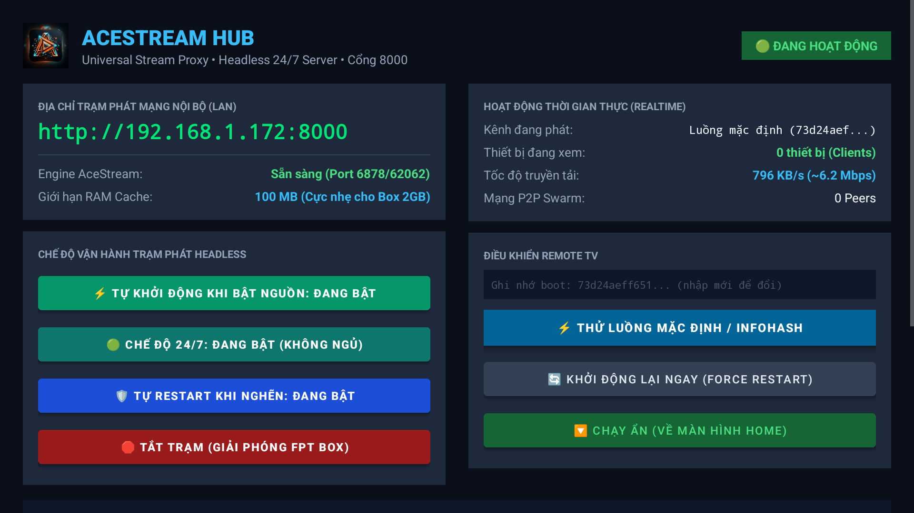

# Sơ Đồ Giao Diện AceHub Trên Màn Hình TV (AceHub TV UI Map)

Tài liệu này giải thích trực quan bố cục giao diện điều khiển bằng remote (D-Pad) của AceHub trên màn hình Android TV Box.

  

---

## 6 Vùng Chức Năng Chính Trên Màn Hình

| Vùng | Tên Vùng | Hiển Thị Trên Màn Hình | Tác Dụng & Hành Động Người Dùng |
| :---: | :--- | :--- | :--- |
| **1** | **Trạng Thái Trạm & Địa Chỉ IP** | `🟢 ĐANG HOẠT ĐỘNG` `Địa chỉ phát: http://192.168.x.x:8000/live` | Cho biết AceHub đã sẵn sàng phục vụ trong mạng nhà. Địa chỉ `http://192.168.x.x:8000/live` là link duy nhất để các thiết bị khác (VLC, TV, điện thoại) kết nối vào xem. |
| **2** | **Trạng Thái Engine Ngầm** | `Engine: Sẵn sàng (Port 6878/62062)` | Báo trạng thái của bộ máy P2P nền. Khi hiển thị `Sẵn sàng`, người dùng có thể bắt đầu thử luồng hoặc phát kênh. Nếu báo `Đang tải` hay `Đang giải nén`, chỉ cần tiếp tục chờ. |
| **3** | **Cụm Nút Chế Độ 24/7** | • `⚡ Tự khởi động: ĐANG BẬT` • `🟢 Chế độ 24/7: ĐANG BẬT` • `🛡️ Tự Restart khi nghẽn: ĐANG BẬT` • `🛑 TẮT TRẠM (Giải phóng Box)` | Điều khiển chế độ vận hành liên tục. Mặc định cả 3 tính năng tự chạy, chống ngủ và tự phục hồi đều được BẬT sẵn. Nút đỏ cuối cùng dùng để tắt hẳn AceHub khi cần trả lại toàn bộ tài nguyên cho Box. |
| **4** | **Ô Nhập Content ID / Infohash** | Gợi ý: `Nhập Infohash (hoặc để trống để test mặc định)` | Dùng remote bấm vào để nhập mã luồng phát 40 ký tự bằng bàn phím ảo. **Đặc biệt: Có thể để trống hoàn toàn để kiểm tra bằng luồng mẫu.** |
| **5** | **Nút Thử Tín Hiệu (Test)** | `⚡ Thử luồng mặc định / Infohash` | Bấm nút này để kích hoạt quy trình kiểm tra 3 mức. Nếu ô trên để trống, AceHub sẽ tự động chạy luồng mẫu mã nguồn mở để xác nhận kết nối. |
| **6** | **Cụm Nút Bảo Trì & Điều Khiển** | • `🔄 Khởi động lại ngay (Force Restart)` • `🔽 Chạy ẩn (Về màn hình Home)` • `🧹 Xóa nhật ký` | Dùng khi cần khởi động lại nhanh dịch vụ, ẩn AceHub xuống chạy ngầm để dùng tivi xem ứng dụng khác, hoặc dọn sạch cửa sổ nhật ký chẩn đoán phía dưới. |

---

## Danh Mục Hình Ảnh Hiện Có & Kế Hoạch Bổ Sung (Screenshot Inventory)

1. **`acehub_tv_ui.png` (Hiện có):** Chụp toàn cảnh giao diện làm việc thực tế của AceHub trên Android TV 1080p, hiển thị đầy đủ bảng điều khiển D-Pad, nút bấm, thông số mạng và terminal log.
2. **`acehub_ecosystem_chain.jpg` (Hiện có):** Sơ đồ chuỗi sinh thái AceHub từ Box trung tâm truyền phát tới Smart TV và các thiết bị gia đình.
3. **`acehub_showcase.jpg` (Hiện có):** Banner giới thiệu tổng quan hệ thống AceHub.
4. **Kế hoạch bổ sung (Upcoming Assets):**
   - Ảnh chụp trạng thái `⏳ ĐANG TẢI ENGINE` trên màn hình TV thật.
   - Ảnh chụp màn hình VLC trên Windows/Mac khi đang phát luồng `/live`.
